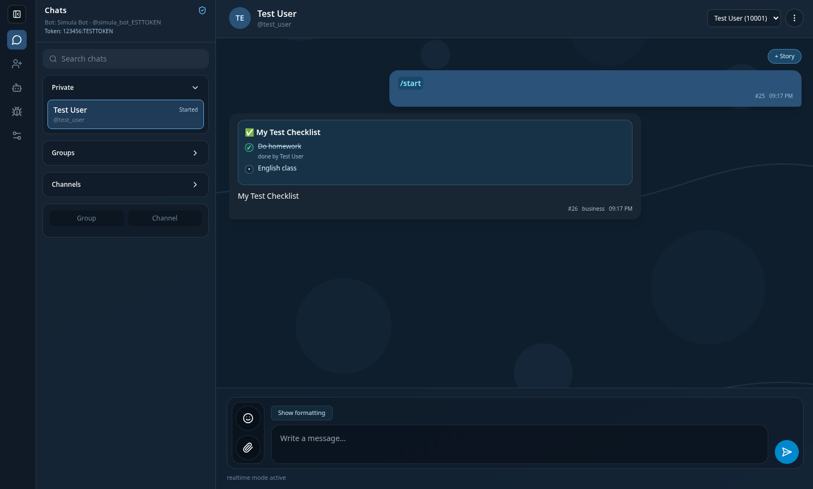

# Simula

A local Telegram Bot API simulation environment for building, testing, and debugging Telegram bots with realtime runtime simulation and full API compatibility.

Simula allows developers to build and test Telegram bot integrations locally using any programming language, framework, or bot library. Instead of communicating with production Telegram services during development, bots interact with a local runtime environment, enabling faster iteration, safer debugging, and fully controlled testing workflows.

[Full Documentation](https://laraxgram.github.io/simula)

## Development Phases

### Phase 1 — In Progress
**Objective:** Achieve full API method parity with the official version

- [ ] Expand API methods
- [ ] Ensure 100% compatibility with the official implementation
- [ ] Align behavior and responses with the official client
- [ ] Validate stability of newly added methods

### Phase 2
**Objective:** Client rewrite using Electrobun and desktop distribution

- [ ] Rewrite the client using Electrobun
- [ ] Improve performance and maintainability
- [ ] Prepare cross-platform desktop builds
- [ ] Publish desktop releases for:
  - [ ] Windows
  - [ ] Linux
  - [ ] macOS
  
## Contributing

> [!IMPORTANT]
> Since the client is currently undergoing a rewrite, pull requests related to the `client` will not be accepted until further notice.

Thank you for considering contributing to the LaraGram Simula! The contribution guide can be found in the [LaraGram documentation](https://laraxgram.github.io/v3/contributions.html).

## Code of Conduct

In order to ensure that the LaraGram community is welcoming to all, please review and abide by the [Code of Conduct](https://laraxgram.github.io/v3/contributions.html#code-of-conduct).

## Security Vulnerabilities

If you discover a security vulnerability within LaraGram, please send an e-mail to LaraXGram via [laraxgram@gmail.com](mailto:laraxgram@gmail.com). All security vulnerabilities will be promptly addressed.

## License

The LaraGram Simula is open-sourced software licensed under the [MIT license](https://opensource.org/licenses/MIT).